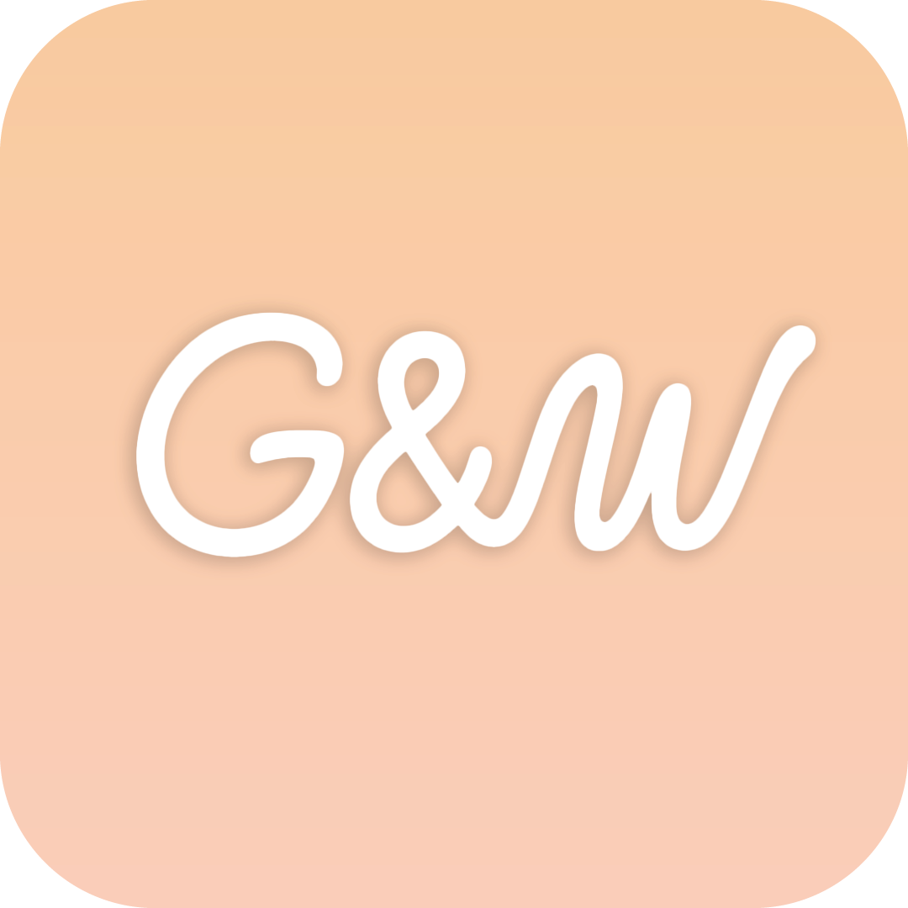

# Glide & Write

Glide & Write is an intuitive, accessible, gesture-based communication application specifically designed for non-verbal individuals or those with speech impairments. By utilizing simple directional swipes or continuous screen glides, users can rapidly construct sentences and communicate their thoughts aloud using built-in text-to-speech.

## 📖 How It Works

Users create words by swiping their fingers in the "Swipe Area" on the screen. The app offers two primary writing modes to accommodate different user preferences and experience levels:

### 1. Input Modes: Step vs. Glide

*   **Step Mode:** In this mode, each directional movement is a discrete, step-by-step action. You swipe in a direction, lift your finger, and then tap once to select the word, or swipe again in another direction to continue a combination. Since each direction and word selection is a separate action, this mode is the most suitable method for beginners to get accustomed to the writing system.
*   **Glide Mode:** In this mode, you can glide your finger in desired directions within the Swipe Area without ever lifting it. For example, you can make a downward movement and then draw upwards. The moment you lift your finger, the current word is selected. To perform the same direction twice consecutively, simply make a small movement in that direction, pause briefly, and move in the same direction again.

**Visual Feedback Example:**
Let's say in a configuration: a right swipe calls the word "I", and swiping right then left calls the word "you".
When the user looks at the Swipe Area, they see "I" written next to the right arrow.
In **Glide Mode**, when the user draws to the right, a gray "I" previews in the text area above, and the Swipe Area now shows "you" on the left side.
Without lifting their finger, the user then swipes left. The text area now previews "you".
The moment they lift their finger, the word is selected and written in black text. Everything is now ready to move on to the next word.


---

### 🎛 Operating Modes (Talk On vs. Entry On)

At the top right corner, there is a toggle button that switches between "Talk On" and "Entry On".

*   **Talk On:** When this is active, all the writing actions described above are performed normally.
*   **Entry On:** When activated, the background turns red to clearly indicate the change in state. In this mode, directional combinations no longer write text. Instead, after performing a combination, a popup appears. This allows the user to determine or revise which word that specific combination of swipes will produce. This is where users build and edit their vocabulary.

---

### 📚 Layers (Maximize Vocabulary)

A person in Glide Mode can write 4 different words with a single finger movement using this method. 
With two finger movements, they can write 16 words; with three movements, 64; and with four movements, 256 characters. 
In total, by making a maximum of 4 movements, a user can write **340 unique words** (combinations longer than 4 are, of course, also possible).

The **Layer System** allows users to write even more words with fewer movements. Each layer can host completely separate combinations. 
To switch layers, the user can either press the dedicated layer buttons or quickly swipe two fingers up or down within the Swipe Area.

---

### ⚡ Quick Symbols

Located below the Swipe Area is a writing tool containing 14 quickly accessible buttons. These slots can hold symbols or words up to a maximum of 5 characters.
From the Settings menu, the user can change the function (the text) of these buttons and create 4 different sets/templates.

**The Prefix Hyphen (-) Feature**
As an additional feature, if words added to the Swipe Area or Quick Symbols start with a hyphen (e.g., `-ing`) and are followed by text without spaces, the app treats them as suffixes. It will append this text directly to the previous word without adding a space. 
*Example:* If the last written word is "go", and "-ing" is inputted via the Swipe Area or Quick Symbols, the final word will become "going".

---

### 🕹️ Action Buttons

At the top of the interface, four key action buttons help manage your sentence:

*   **Clear:** Instantly clears all the text currently in the text area.
*   **Undo:** Deletes the last word or action you performed.
*   **Type:** Opens the standard on-screen keyboard, allowing you to manually type a word that you might not have added to your gesture dictionary yet.
*   **Speak:** Activates the Text-to-Speech (TTS) engine to read the drafted sentence aloud.

---

### ⚙️ Configurations


The **Configurations** section allows you to manage entirely separate dictionaries and environments. You can create different configurations for different contexts (like "School", "Home", or different languages).
Each configuration stores its own set of words, layer combinations, and target spoken language. This ensures that the Text-to-Speech engine uses the correct voice profile and pronunciation for the active configuration.

---

### 🛠 Settings


The **Settings** menu gives you full control over the application's behavior and appearance:

*   **Appearance (Themes):** Choose from 6 carefully designed visual themes (Bone, Oatmeal, Slate, Sage, Charcoal, Midnight) for optimal contrast and eye comfort.
*   **UI Language:** Change the interface language of the app (supports multiple languages including English, Turkish, Spanish, French, etc.).
*   **Glide Pause Duration:** Adjust the wait time (in milliseconds) required to register consecutive swipes in the same direction while in Glide Mode.
*   **Layer Toggle & Settings:** Customize how many layers are available and whether the layer toggle buttons are displayed on the left or right side of the screen.
*   **Quick Symbols:** Edit the 4 available templates for the 14-button Quick Symbols bar, assigning any short text or punctuation to each slot.

---

## 🛠 Tech Stack

*   **Core:** [React 19](https://react.dev/) + [TypeScript](https://www.typescriptlang.org/)
*   **Build Tool:** [Vite](https://vitejs.dev/)
*   **Styling:** [Tailwind CSS 4](https://tailwindcss.com/)
*   **Animation:** [Motion](https://motion.dev/)
*   **Icons:** [Lucide React](https://lucide.dev/)
*   **Mobile Runtime:** [Capacitor](https://capacitorjs.com/) (Targeting Android & iOS)

## 🚀 Local Development

### Prerequisites
*   [Node.js](https://nodejs.org/) (v18 or higher recommended)

### Setup

1.  **Clone the repository:**
    ```bash
    git clone https://github.com/eedali/GlideAndWrite
    cd GlideAndWrite
    ```

2.  **Install dependencies:**
    ```bash
    npm install
    ```

3.  **Start the development server:**
    ```bash
    npm run dev
    ```
    The app will be available at `http://localhost:3000`.

## 📱 Mobile Build (Capacitor)

This project is configured as a cross-platform mobile app using Capacitor. To sync your web assets and open the Android project in Android Studio:

```bash
# Build the web assets first
npm run build

# Sync the assets to the Android project
npx cap sync android

# Open Android Studio
npx cap open android
```

## 🤝 Contributing

Contributions, issues, and feature requests are highly encouraged! Feel free to check the issues page or open a pull request.

## 📄 License

This project is open-source and free to use.
